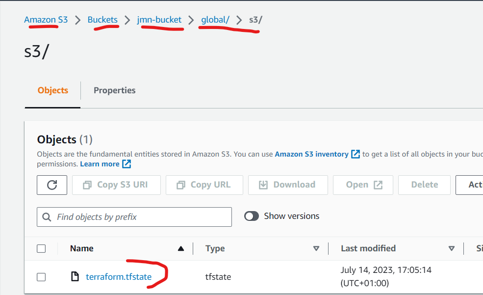
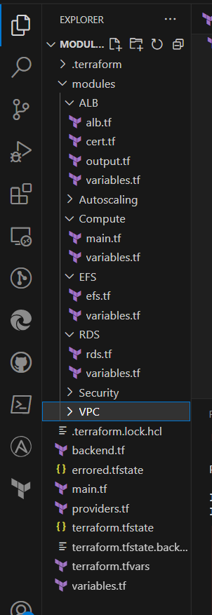

# Automate Infrastructure With IAC Using Terraform Part 3

**Step 1 - Configure Backend On AWS S3 Bucket**
---

*The Terraform state file (.tfstate) is stored locally by default. This shouldn't be a problem for an individual but it would be a problem for a team of engineers. This step would involve pushing the state file to the cloud for access by all engineers*

- On your `main.tf` file, add the code below to create the S3 bucket, enable versioning and encryption.

```
# Create s3 bucket
resource "aws_s3_bucket" "terraform-state" {
  bucket = "jmn-bucket"
  force_destroy = true
}

# Enable versioning on s3 bucket
resource "aws_s3_bucket_versioning" "version" {
  bucket = aws_s3_bucket.terraform-state.id
  versioning_configuration {
    status = "Enabled"
  }
}

# Enable encryption for s3 bucket
resource "aws_s3_bucket_server_side_encryption_configuration" "first" {
  bucket = aws_s3_bucket.terraform-state.id
  rule {
    apply_server_side_encryption_by_default {
      sse_algorithm = "AES256"
    }
  }
}
```

- Run `terraform init` and `terraform apply` so the S3 bucket can be created. If you do not do so, you'll encounter an error as terraform expects the bucket to have already been created before it pushes to the cloud.

- Insert the following code below in `main.tf` to create a Dynamo DB table. This table would handle locks and perform consistency checks. Run `terraform apply` again.

*The locks being put in place here is a securoty measure to prevent the corrupting of your local state file. Locking is usually handled locally but since we would hypothetically eb working with a team of engineers, we need to deploy the locking mechanism in the cloud as well.*

```
#Create dynamo DB for terraform locks
resource "aws_dynamodb_table" "terraform_locks" {
  name         = "terraform-locks"
  billing_mode = "PAY_PER_REQUEST"
  hash_key     = "LockID"
  attribute {
    name = "LockID"
    type = "S"
  }
}
```

- Create a new file called `backend.tf`. This would house the instructions given to Terraform to push the state file to the S3 bucket. Remember that the bucket must have been created first.

```
# Push state file to cloud
terraform {
  backend "s3" {
    bucket         = "jmn-bucket"
    key            = "global/s3/terraform.tfstate"
    region         = "us-east-1"
    dynamodb_table = "terraform-locks"
    encrypt        = true
  }
}
```

- Run `terraform init` to initialize the backend, which will inform terraform to push the state file to the cloud. After that, run `terraform apply` to deploy configuration. See screenshot below for results.



**Step 2 - Refactor The Code Using Modularization**
---

- Create a new folder called `modules`. This is the folder that will house all modularization that would occur in this project.

- Create the following subfolders inside the `modules` folder you just created. They are: **ALB, VPC, EFS, RDS, Compute, Security & Autoscaling**.

- For each of the newly created subfolders, create the following files as they would house configurations respective to their folder names: **main.tf, variables.tf & output.tf**. *Some of the folders may not necessarily need a `main.tf` or `output.tf` file. Unused files can be deleted or renamed*.



